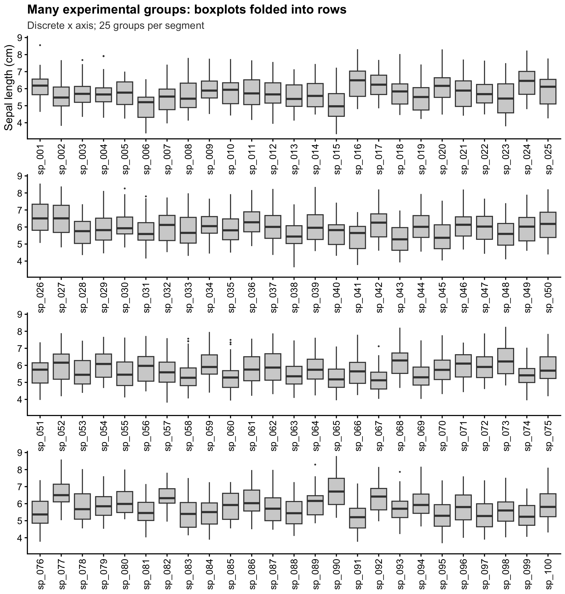
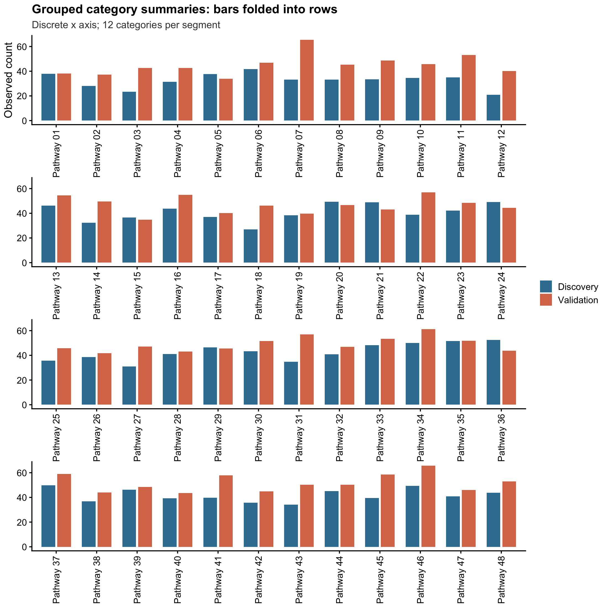
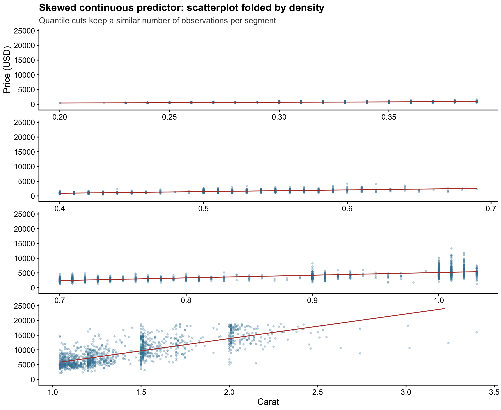
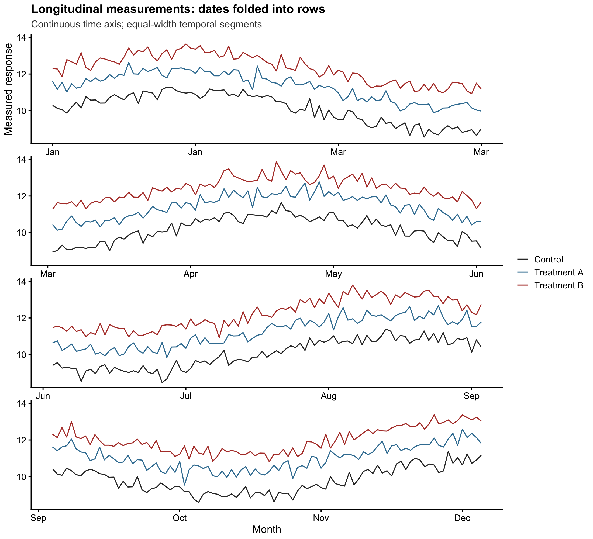
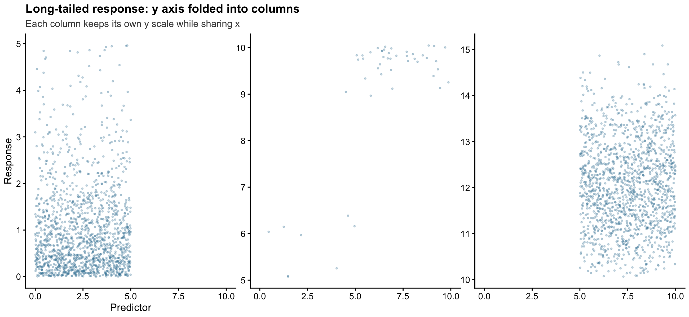
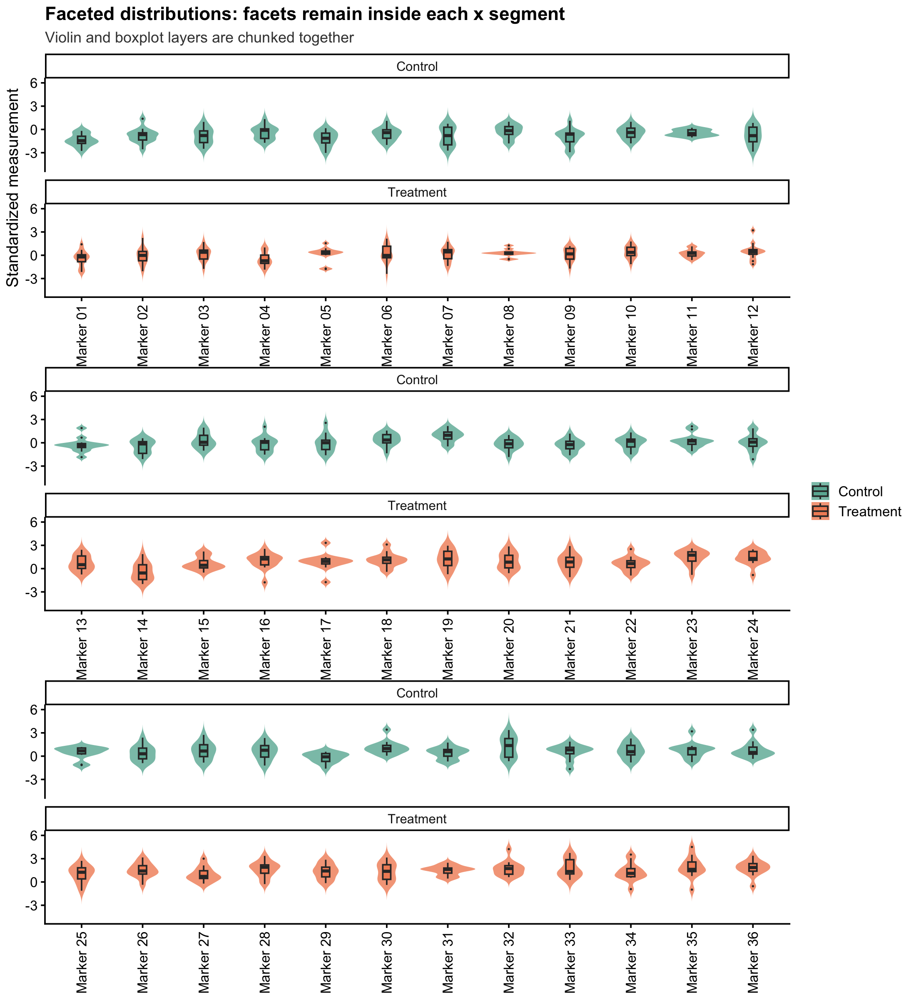
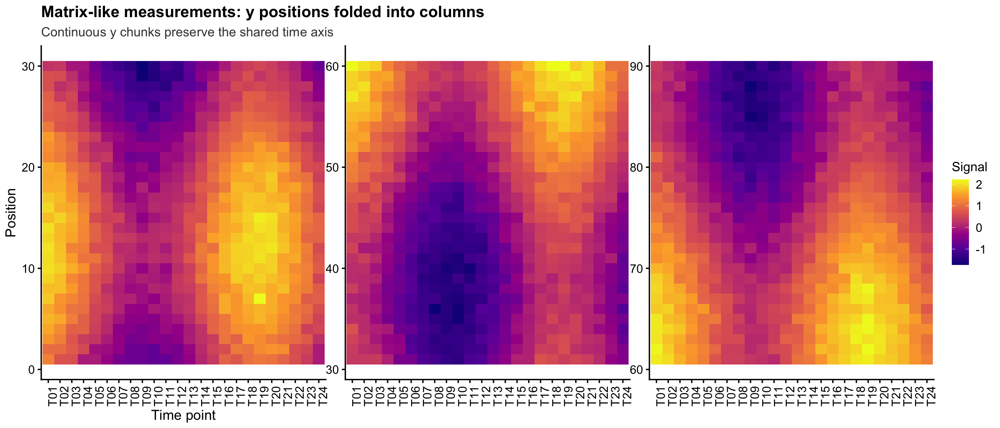

# ggchunk

**ggchunk** adds a `+ ggchunk()` verb to **ggplot2** pipelines for folding an
overly long or high axis into one continuous figure:

- a long **x axis** is folded into consecutive rows;
- a high **y axis** is folded into consecutive columns;
- each segment keeps its own chunked-axis scale;
- the perpendicular axis is fixed across segments by default;
- existing layers, facets, themes, labels and legends remain available.

This is not ordinary `facet_wrap()`: the segments represent consecutive parts
of one long axis rather than independent subgroups.

**ggchunk** 为 ggplot2 管道增加一个 `+ ggchunk()` 操作，把过长的 x 轴或过高的 y
轴分块绘制在同一张图中。它适合论文中类别过多、时间轴过长、连续变量分布跨度过大，
但又不希望把图拆成多个文件或普通分面图的场景。

## Installation

```r
# install.packages("remotes")
remotes::install_local("path/to/ggchunk")
```

Requires R >= 4.0 and ggplot2 >= 3.4. The optional `patchwork` package is
recommended for collecting legends and composing the final figure.

## Quick start

```r
library(ggplot2)
library(ggchunk)

# Many categories: x is folded into rows
ggplot(iris100, aes(Species, Sepal.Length)) +
  geom_boxplot() +
  ggchunk(method = "x", n_per_chunk = 25)

# A long-tailed response: y is folded into columns
d_y <- data.frame(
  x = seq(0, 10, length.out = 3000),
  y = c(rexp(1500, 1), rnorm(1500, 12, 1))
)
ggplot(d_y, aes(x, y)) +
  geom_point(alpha = 0.3) +
  ggchunk(method = "y", n_chunks = 3)
```

The default output is marker-free. To add a small continuation arrow in the
gutter between segments, use `ggchunk(show_indicator = TRUE)`.

## Why ggchunk?

| Problem | Ordinary solution | ggchunk solution |
|---|---|---|
| 100+ categorical levels | tiny labels or many separate plots | consecutive x-axis rows |
| long time or dose axis | compressed x scale | continuous x chunks |
| extreme or long-tailed y values | hide the lower/upper range | y-axis columns |
| multiple biological/clinical groups | manually rebuild each plot | preserve `facet_wrap()` and chunk the axis |
| comparing segments | independent panel limits | fixed perpendicular axis by default |

## Methods and key arguments

| Argument | Meaning | Typical use |
|---|---|---|
| `method = "x"` | Fold x into rows | boxplots, bars, time series, dense x-scatter |
| `method = "y"` | Fold y into columns | long-tailed responses, vertical heatmaps |
| `method = "auto"` | Detect a suitable x strategy | exploratory plotting |
| `n_per_chunk` | Discrete x levels per segment | `n_per_chunk = 20` |
| `n_chunks` | Number of continuous segments | `n_chunks = 3` or `4` |
| `even = TRUE` | Use quantile cuts for similar observation counts | skewed continuous x |
| `fixed_perpendicular = TRUE` | Share the non-chunked axis range | manuscript comparisons |
| `fixed_perpendicular = FALSE` | Train the non-chunked axis independently | emphasize within-segment patterns |
| `show_indicator = TRUE` | Show gutter continuation arrows | optional continuity cue |

### Fixed versus independent perpendicular scales

The default keeps the non-chunked axis comparable across all segments. For x
chunks, every row shares the same y range; for y chunks, every column shares
the same x range.

```r
base <- ggplot(iris100, aes(Species, Sepal.Length)) +
  geom_boxplot()

base + ggchunk(method = "x", n_per_chunk = 25,
               fixed_perpendicular = TRUE)   # default

base + ggchunk(method = "x", n_per_chunk = 25,
               fixed_perpendicular = FALSE)  # independent y ranges
```

Explicit `scale_*()` limits and `coord_*()` limits are respected. This also
preserves baselines introduced by geoms such as `geom_col()`.

## Example gallery

The examples are rendered from `examples/render_examples.R` and cover common
academic plotting situations. Each image is a complete single figure, not a
collection of separately exported panels.

### Many categorical groups

**Boxplots** are useful for comparing distributions across many experimental
groups. The x axis is divided into rows while the y range stays comparable.



**Grouped bars** are useful for counts, pathway summaries and effect-size
comparisons. Both fill groups and the zero baseline are preserved.



### Continuous axes

**Equal-density scatter chunks** are useful when observations are concentrated
in only part of a skewed x range.



**Longitudinal measurements** can be folded into readable time rows while
retaining the original line layers and series colours.



**Long-tailed responses** can be folded horizontally along y, making both the
low and high ranges visible without shrinking the entire plot into one panel.



### Facets and matrix-like data

`facet_wrap()` remains intact inside each x-axis segment, which is useful for
stratified distributions and clinical/biological groups.



Continuous y chunks also work for matrix-like measurements or heatmaps.



Regenerate all examples with:

```bash
Rscript examples/render_examples.R
```

## Working with the result

```r
p <- ggplot(...) + ... +
  ggchunk(method = "x", n_per_chunk = 20)

p                         # print the complete figure
n_chunks(p)               # number of segments
chunk_info(p)             # segment summary
chunk_plot(p)             # complete ggplot/patchwork object
chunk_plot(p, 2)          # one raw segment
ggsave_chunk(p, "out.pdf", width = 9, height = 10)
```

The returned object remains compatible with ordinary ggplot2 additions:

```r
p +
  labs(title = "Folded axis figure") +
  theme_classic(base_size = 14) +
  theme(
    axis.text = element_text(size = 12),
    axis.title = element_text(size = 14)
  )
```

When no explicit theme is supplied, ggchunk uses a restrained academic
default: 14 pt text, 12 pt axis text, 14 pt axis titles and 16 pt plot titles.
Explicit `theme_*()` and `theme()` settings remain under user control.

## Development

Run the package tests with:

```bash
Rscript -e 'testthat::test_local(reporter = "summary")'
```

The package is tested against current ggplot2 4.x development patterns while
retaining an API target of ggplot2 >= 3.4.

## License

MIT (c) 2026 Nuan.
